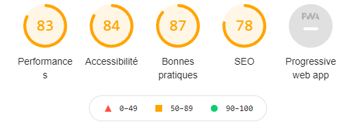
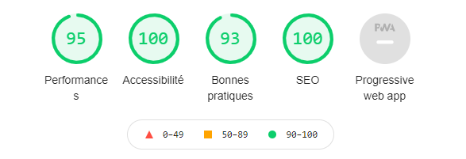

### School project OpenClassrooms : Optimisez un site web existant ###

Projet : Apporter des modifications au code source d'un site web pour améliorer ses performances

Optimiser la taille et la vitesse d’un site web

Réaliser une recherche des bonnes pratiques en développement web

Optimiser le référencement d'un site web

Assurer l'accessibilité d'un site web

Outils utilisés pour réaliser le rapport d'optimisation : Wave, Lighthouse, Dareboost, GTmetrix 

Analyse Lighthouse avant les modifications : 

Analyse Lightouse après les modifications : 

